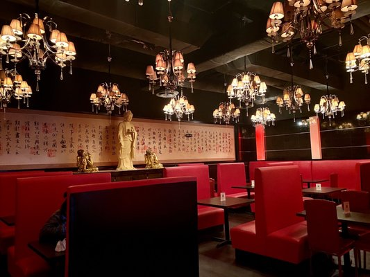
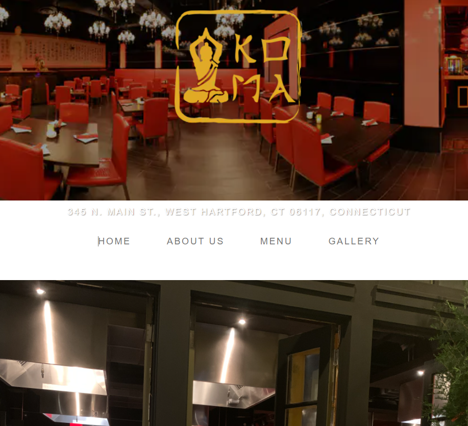

[Koma Japanese Hibachi](komajapanesehibachi.com) is an asian style restaurant [located](https://www.google.com/maps/place/Koma+Japanese+Steakhouse+and+Sushi/@41.7851862,-72.7499793,17z/data=!3m1!4b1!4m5!3m4!1s0x89e7ab7d0bd45201:0xe13eab83fe2eb66e!8m2!3d41.7851862!4d-72.7477906) in Bishops Corner, West Hartford CT

We designed a clean, modern website for them using HTML, CSS and JavaScript with
- Multiple slideshows of the interior and food
- Description of their history and what food they provide
- Custom designed and sized pictures

